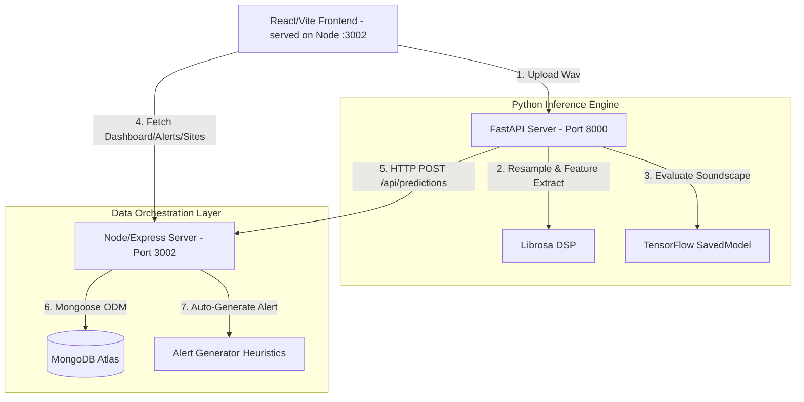

# 🌊 AquaListen - AI-Powered Coral Reef Health Monitoring System

AquaListen is an advanced, non-invasive marine conservation platform that leverages deep learning to analyze underwater acoustics and assess coral reef ecosystem health. By analyzing biological soundscapes, AquaListen classifies reef environments into three core ecological states: **Healthy**, **Stressed**, and **Ambient**.

---

## Table of Contents

1. [Overview](#overview)
2. [System Architecture](#1-system-architecture--component-mapping)
3. [ML Inference Pipeline](#2-ml-inference-pipeline)
4. [End-to-End Data Flow](#3-end-to-end-data-flow-sequence)
5. [Frontend Component Tree](#4-frontend-component-tree)
6. [Node.js Server Architecture](#5-nodejs-server-architecture)
7. [Python API Architecture](#6-python-api-architecture)
8. [Folder Relationships](#7-folder-relationships)
9. [Classification Decision Tree](#8-classification-decision-tree-verified)
10. [ML Pipeline — Verified from Code](#ml-pipeline--verified-from-code)
11. [Google SurfPerch vs. AquaListen](#9-what-google-surfperch-is-vs-what-aqualisten-is)
12. [API Reference & Payload Specs](#10-api-reference--payload-specs)
13. [Environment & Configuration Reference](#11-environment--configuration-reference)
14. [Operational & Deployment Guide](#12-operational--deployment-guide)
15. [Port Assignments](#13-port-assignments)
16. [Troubleshooting & Common Issues](#14-troubleshooting--common-issues)

---

## Overview

AquaListen is a full-stack web application that classifies coral reef health from hydrophone audio recordings. It combines **Google SurfPerch** (a 10,932-class bird/wildlife acoustic taxonomy model served as a TensorFlow SavedModel) with **AquaListen's custom ecological mapping logic** to produce three reef health categories: `healthy`, `stressed`, and `ambient`.

The system consists of:

| Component | Technology | Port |
|-----------|-----------|------|
| ML Inference API | Python · FastAPI · TensorFlow | `8000` |
| Database + Web Server | Node.js · Express · MongoDB Atlas | `3002` |
| Frontend Dashboard | React · Vite · TailwindCSS | served by Node on `3002` |

> **Note on the frontend port:** In development, Vite is mounted as middleware inside the Express server (`setupVite(app, server)`), so the dashboard is served from the same origin as the API, `http://localhost:3002`. Vite's HMR socket runs internally and is not exposed as its own public port.

---

## 1. System Architecture & Component Mapping

AquaListen runs in a decoupled configuration where heavy DSP (Digital Signal Processing) and ML workloads are handled by Python/FastAPI, while user requests, state storage, and configuration are managed by Node.js/Express/Mongoose.

### 1.1 Complete Component Overview



### 1.2 High-Level System Diagram

```
┌─────────────────────────────────────────────────────────────────┐
│                        USER BROWSER                              │
│              React + Vite + TailwindCSS + shadcn/ui              │
│                    served from localhost:3002                    │
└──────────────┬──────────────────────────┬────────────────────────┘
               │                          │
        Audio upload                 All data reads
        POST /predict            (stats, sites, alerts,
               │                   predictions)
               ▼                          ▼
┌──────────────────────┐   ┌──────────────────────────────────────┐
│  Python FastAPI       │   │  Node.js Express                     │
│  localhost:8000       │   │  localhost:3002                      │
│                       │   │                                       │
│  ML Inference         │──▶│  POST /api/predictions               │
│  Audio Processing     │   │  (save result to DB)                 │
│  Feature Extraction   │   │                                       │
└──────────────────────┘   └────────────────┬─────────────────────┘
               │                            │
               │                            ▼
               │              ┌─────────────────────────┐
               │              │  MongoDB Atlas           │
               │              │  (cloud)                 │
               │              │                          │
               │              │  Collections:            │
               │              │  • reefSites             │
               │              │  • predictions           │
               │              │  • alerts                │
               │              │  • users                 │
               └──────────────└─────────────────────────┘
```

---

## 2. ML Inference Pipeline

```
                        ┌──────────────┐
                        │  Audio File   │
                        │  .wav .mp3    │
                        │  .flac .m4a   │
                        └──────┬───────┘
                               │
                               ▼
                  ┌────────────────────────┐
                  │  librosa.load()         │  [AquaListen]
                  │  sr = native            │
                  │  No resampling here     │
                  └────────────┬───────────┘
                               │
                               ▼
                  ┌────────────────────────┐
                  │  extract_audio_         │  [AquaListen]
                  │  features()             │
                  │                         │
                  │  Pad/truncate to        │
                  │  1.88 s * sr            │
                  │                         │
                  │  Computes:              │
                  │  • spectral_centroid    │
                  │  • spectral_bandwidth   │
                  │  • zero_crossing_rate   │
                  │  • mfcc (13 coeffs)     │
                  │  • spectral_rolloff     │
                  │  • log-mel spectrogram  │
                  │    (128 mels, computed  │
                  │     but NOT used by TF) │
                  │  • raw_audio copy       │
                  └────────────┬───────────┘
                               │
               ┌───────────────┴────────────────┐
               │                                │
               ▼                                ▼
┌──────────────────────────┐    ┌────────────────────────────────┐
│  compute_anthropogenic_   │    │  predict_with_aqualisten_       │
│  noise_score()            │    │  model()                        │
│                           │    │                                  │
│  [AquaListen]             │    │  [AquaListen wrapper]            │
│                           │    │                                  │
│  From raw_audio:          │    │  raw_audio →                     │
│  FFT → low-freq ratio     │    │  pad/truncate to 160,000         │
│                           │    │  samples (10 s @ 16 kHz)          │
│  Indicators:              │    │                                  │
│  • centroid  (wt=0.30)    │    │  batch dim → (1, 160000)         │
│  • bandwidth (wt=0.20)    │    │  tf.float32 tensor                │
│  • ZCR       (wt=0.10)    │    │                                  │
│  • lowfreq_r (wt=0.40)    │    └───────────────┬────────────────┘
│                           │                    │
│  Linear ramp scoring      │                    ▼
│  → score in [0.0, 1.0]    │    ┌────────────────────────────────┐
└────────────┬──────────────┘    │  [Google SurfPerch]              │
             │                   │  tf.saved_model.load()           │
             │                   │  signatures['serving_default']   │
             │                   │  input key: 'inputs'             │
             │                   │                                  │
             │                   │  Internal (inferred from         │
             │                   │  SurfPerch paper, not visible     │
             │                   │  in SavedModel graph):            │
             │                   │  • STFT                          │
             │                   │  • Log-mel spectrogram            │
             │                   │  • EfficientNet-B0 backbone       │
             │                   │                                  │
             │                   │  Outputs:                        │
             │                   │  output_0: (1, 10932) logits      │
             │                   │  output_1: (1, 1280) embedding    │
             │                   └───────────────┬────────────────┘
             │                                   │
             │                                   ▼
             │                   ┌────────────────────────────────┐
             │                   │  process_aqualisten_             │
             │                   │  predictions()                  │
             │                   │                                  │
             │                   │  [AquaListen]                    │
             │                   │                                  │
             │                   │  softmax(output_0 logits)        │
             │                   │  → class_probs [10932]           │
             │                   │                                  │
             │                   │  top-10 indices & probs          │
             │                   │                                  │
             │                   │  Shannon Entropy                 │
             │                   │  Richness (prob > 0.005)          │
             │                   │  Dominance (max/sum_top10)        │
             │                   │                                  │
             │                   │  Rule-based mapping →             │
             │                   │  health_status + confidence       │
             │                   └───────────────┬────────────────┘
             │                                   │
             └──────────────┬────────────────────┘
                            │
                            ▼
               ┌────────────────────────┐
               │  classify_reef_health() │
               │                         │
               │  [AquaListen]           │
               │                         │
               │  Fusion Policy:         │
               │  anthro < 0.3  → trust  │
               │  0.3–0.6 → −5–15%      │
               │  0.6–0.8 → −15–25%     │
               │  ≥0.8 + low conf        │
               │    → override stressed │
               │  ≥0.8 + high conf       │
               │    → trust, −15%       │
               │                         │
               │  Final:                 │
               │  health_status          │
               │  confidence [0.5,0.95]  │
               │  diagnostics dict       │
               └────────────┬───────────┘
                            │
                            ▼
               ┌────────────────────────┐
               │  POST /api/predictions  │
               │  → Node.js :3002        │
               │  → MongoDB               │
               │  → Auto-alert if         │
               │    stressed + conf>0.7   │
               └────────────────────────┘
```

---

## 3. End-to-End Data Flow (Sequence)

```
Browser          Python :8000        Node.js :3002        MongoDB
   │                   │                    │                 │
   │  POST /predict     │                    │                 │
   │  (multipart/form)  │                    │                 │
   │──────────────────▶│                    │                 │
   │                   │                    │                 │
   │                   │ librosa.load()      │                 │
   │                   │ extract_features()  │                 │
   │                   │ anthro_score()      │                 │
   │                   │ surfperch infer      │                 │
   │                   │ ecological map       │                 │
   │                   │ fusion               │                 │
   │                   │                    │                 │
   │                   │  GET /sites         │                 │
   │                   │───────────────────▶│                 │
   │                   │                    │── find() ──────▶│
   │                   │                    │◀── sites ───────│
   │                   │◀── sites ──────────│                 │
   │                   │                    │                 │
   │                   │  POST /api/predictions                │
   │                   │───────────────────▶│                 │
   │                   │                    │── insertOne() ─▶│
   │                   │                    │  (prediction)    │
   │                   │                    │                 │
   │                   │                    │  if stressed     │
   │                   │                    │  + conf > 0.7:   │
   │                   │                    │── insertOne() ─▶│
   │                   │                    │  (alert)         │
   │                   │                    │◀── ok ──────────│
   │                   │◀── 200 ok ─────────│                 │
   │                   │                    │                 │
   │◀── JSON response ─│                    │                 │
   │  (prediction +     │                    │                 │
   │   diagnostics)     │                    │                 │
   │                   │                    │                 │
   │  GET /dashboard/    │                    │                 │
   │  stats             │                    │                 │
   │──────────────────────────────────────▶│                 │
   │                   │                    │── aggregate ───▶│
   │                   │                    │◀── stats ───────│
   │◀── stats ─────────────────────────────│                 │
```

---

## 4. Frontend Component Tree

```
App.tsx
├── QueryClientProvider        (@tanstack/react-query)
├── ThemeProvider               (next-themes, key: "aqua-listen-theme")
├── TooltipProvider
├── SidebarProvider
│   └── SitesProvider           (context: sites array)
│       ├── AppSidebar
│       │   └── SidebarMenu
│       │       ├── Dashboard   → /
│       │       ├── Upload      → /upload
│       │       ├── Batch       → /batch
│       │       ├── Sites       → /sites
│       │       ├── Alerts      → /alerts
│       │       ├── Model Info  → /model-info
│       │       └── Settings    → /settings
│       ├── header
│       │   ├── SidebarTrigger
│       │   └── ThemeToggle
│       └── main (Router)
│           ├── Dashboard.tsx
│           │   ├── ModelStatusBanner
│           │   ├── DashboardStats       ← live: GET :3002/dashboard/stats
│           │   ├── HealthStatusCard[]   ← live: GET :3002/predictions/recent
│           │   ├── AreaChart            ← MOCK trend data
│           │   ├── LineChart            ← MOCK confidence data
│           │   ├── ConfidenceGauge      ← hardcoded 84.7
│           │   ├── AlertCard[]          ← MOCK alert data
│           │   └── QuickUploadModal
│           ├── Upload.tsx
│           │   ├── FileUploadArea       ← drag/drop, fake progress
│           │   ├── SpectrogramViewer    ← MOCK canvas spectrogram
│           │   ├── HealthStatusCard     ← real result after upload
│           │   └── Technical Details    ← real result after upload
│           ├── Batch.tsx
│           ├── Sites.tsx                ← live: GET :3002/sites
│           ├── Alerts.tsx               ← live: GET :3002/alerts
│           ├── ModelInfo.tsx            ← MOCK data only
│           └── Settings.tsx
└── Toaster
```

---

## 5. Node.js Server Architecture

```
server/index.ts
├── CORS middleware (wildcard *)
├── express.json()
├── Request logger middleware
├── registerRoutes(app)          ← server/routes.ts
│   ├── GET  /health
│   ├── GET  /dashboard/stats
│   ├── GET  /sites
│   ├── GET  /predictions/recent
│   ├── GET  /alerts
│   ├── GET  /model/info          ← MOCK static JSON
│   ├── POST /predict             ← MOCK random result
│   ├── POST /seed-database
│   ├── POST /add-dynamic-data
│   └── POST /api/predictions     ← real save from Python
├── setupVite(app, server)        ← dev: Vite HMR proxy, mounted as Express middleware
└── listen(:3002, '127.0.0.1')

storage = new MongoStorage()      ← server/storage.ts line 232
   └── MongoStorage               ← server/mongodb-storage.ts
       ├── ensureConnection()     → connectToDatabase()
       │   └── mongoose.connect(MONGODB_ATLAS_URI)
       ├── initializeSampleData() (5 reef sites if empty)
       ├── getAllSites()
       ├── getAllPredictions()
       ├── createPrediction()     + auto-alert
       ├── getAllAlerts()
       ├── getUnreadAlerts()
       ├── createAlert()
       ├── markAlertAsRead()
       └── getDashboardStats()
```

---

## 6. Python API Architecture

```
aqualisten_api.py
│
├── CONSTANTS (top of file)
│   ├── ANTHRO_CENTROID_THRESHOLD       = 500 Hz
│   ├── ANTHRO_BANDWIDTH_THRESHOLD      = 600 Hz
│   ├── ANTHRO_ZCR_THRESHOLD            = 0.03
│   ├── ANTHRO_LOWFREQ_CUTOFF           = 500 Hz
│   ├── ANTHRO_LOWFREQ_RATIO_THRESHOLD  = 0.80
│   ├── ANTHRO_WEIGHT_CENTROID          = 0.30
│   ├── ANTHRO_WEIGHT_BANDWIDTH         = 0.20
│   ├── ANTHRO_WEIGHT_ZCR               = 0.10
│   ├── ANTHRO_WEIGHT_LOWFREQ_RATIO     = 0.40
│   ├── ANTHRO_SCORE_WARN               = 0.3
│   ├── ANTHRO_SCORE_MODERATE           = 0.6
│   ├── ANTHRO_SCORE_OVERRIDE           = 0.8
│   ├── ANTHRO_ML_CONFIDENCE_FLOOR      = 0.60
│   └── DEBUG_PREDICTIONS               = False
│
├── SimpleNodeJSStorage
│   ├── base_url = "http://localhost:3002"
│   ├── getAllSites()      → GET :3002/sites
│   └── createPrediction() → POST :3002/api/predictions
│
├── FastAPI app (CORS: all origins)
│
├── GLOBALS
│   ├── aqualisten_model         (tf.SavedModel)
│   ├── reef_classifications     (dict of DataFrames)
│   ├── model_loaded             (bool)
│   ├── cached_model_signature   (dict, set at startup)
│   └── latest_embedding         (ndarray, (1,1280), unused)
│
├── load_aqualisten_model()
│   ├── tf.saved_model.load("models/savedmodel")
│   ├── _cache_model_signature()
│   └── pd.read_csv() for each *.csv in models/
│
├── _cache_model_signature()      ← called once at startup
├── create_reef_health_mapping()  ← fallback keyword dict
│
├── predict_with_aqualisten_model(audio_features)
│   ├── raw_audio from features dict
│   ├── pad/truncate → 160,000 samples
│   ├── tf.convert_to_tensor(float32)
│   ├── signatures['serving_default'](inputs=tensor)
│   ├── extract output_0 → predictions ndarray
│   ├── cache output_1 → latest_embedding
│   └── → process_aqualisten_predictions()
│
├── process_aqualisten_predictions(predictions)
│   ├── softmax normalization
│   ├── top-10 extraction
│   ├── entropy, richness, dominance
│   ├── normalize entropy to [0.25, 0.70]
│   └── → (health_status, confidence)
│
├── _score_below(value, threshold, ramp_width)
├── _score_above(value, threshold, ramp_width)
│
├── compute_anthropogenic_noise_score(audio_features)
│   ├── spectral_centroid, bandwidth, ZCR from features
│   ├── FFT of raw_audio → low_freq_ratio
│   ├── score each via _score_below / _score_above
│   └── → weighted sum dict
│
├── classify_reef_health(audio_features, filename)
│   ├── [Primary] predict_with_aqualisten_model()
│   ├── [Primary] compute_anthropogenic_noise_score()
│   ├── Fusion policy → final health_status, confidence
│   ├── [Fallback 1] filename keyword matching
│   ├── [Fallback 2] spectral feature rules
│   └── [Fallback 3] weighted random choice
│
├── extract_audio_features(audio, sr)
│
└── ENDPOINTS
    ├── @startup  → load_aqualisten_model()
    ├── GET  /
    ├── GET  /health
    ├── POST /predict            ← main
    ├── POST /batch_predict
    ├── GET  /model/info
    ├── GET  /dashboard/stats
    ├── GET  /sites
    ├── GET  /predictions/recent
    ├── GET  /alerts
    ├── GET  /uploads
    └── GET  /uploads/recent
```

---

## 7. Folder Relationships

```
AquaListen/               ← Project root
│
├── aqualisten_api.py      Standalone Python service
├── models/                Model files and CSVs
│   └── savedmodel/        Loaded by Python at startup
│
└── app/                   Node.js monorepo
    ├── client/            React SPA (bundled by Vite)
    │   └── src/
    │       ├── lib/api.ts   Knows about both :8000 and :3002
    │       ├── pages/       Route-level components
    │       └── components/  Reusable UI components
    ├── server/            Express.js backend
    │   ├── routes.ts        API routes
    │   ├── storage.ts       IStorage interface
    │   ├── mongodb-storage.ts  Active implementation
    │   └── models.ts        Mongoose schemas
    └── shared/
        └── schema.ts       TypeScript types (Drizzle syntax, used for types only)
```

---

## 8. Classification Decision Tree (Verified)

```
                     ┌─────────────────────────┐
                     │  Model loaded?           │
                     └────────┬────────┬────────┘
                           YES│        │NO
                              ▼        ▼
              ┌───────────────────┐  ┌─────────────────────┐
              │ SurfPerch infer    │  │ Fallback 1:          │
              │ + anthro score     │  │ Filename keywords    │
              └──────┬────────────┘  │ (fish/boat/ambient..) │
                     │               └──────────┬──────────┘
               ok?   │                     found│   not found
               ┌─────┴─────┐                   │        │
             YES           NO                  │        ▼
               │            │              return  ┌──────────────┐
               │            ▼               early  │ Fallback 2:  │
               │      ┌─────────────┐             │ spectral      │
               │      │ Fallback 1  │             │ feature rules │
               │      └─────────────┘             └──────┬───────┘
               │                                         │
               ▼                                         │
   ┌────────────────────────┐                            ▼
   │  Fusion Policy          │                   ┌─────────────────┐
   │  anthro_score < 0.3?    │                   │ Fallback 3:      │
   │    → trust ML           │                   │ Weighted random  │
   │  0.3–0.6?               │                   │ 45/30/25 split   │
   │    → mild penalty       │                   └─────────────────┘
   │  0.6–0.8?               │
   │    → moderate penalty   │
   │  ≥ 0.8?                 │
   │    conf < 0.60?         │
   │      → override to      │
   │        stressed         │
   │    conf ≥ 0.60?         │
   │      → trust + −15%    │
   └────────────┬───────────┘
                ▼
        Final: health_status
               confidence
               diagnostics
```

---

## ML Pipeline — Verified from Code

### Stage 1 · Audio Ingestion `[AquaListen]`
**Source:** `aqualisten_api.py` → `POST /predict`

- Accepts: `.wav`, `.mp3`, `.flac`, `.m4a`
- `librosa.load(io.BytesIO(file_contents), sr=None)` — loads at **native sample rate** (no resampling occurs at this stage)
- `extract_audio_features(audio, sr)` runs next

### Stage 2 · Feature Extraction `[AquaListen]`
**Source:** `extract_audio_features()` lines 715–749

Librosa extracts:

| Feature | Method |
|---------|--------|
| Spectral Centroid | `librosa.feature.spectral_centroid` |
| Spectral Bandwidth | `librosa.feature.spectral_bandwidth` |
| Zero Crossing Rate | `librosa.feature.zero_crossing_rate` |
| MFCC (13 coeffs) | `librosa.feature.mfcc(n_mfcc=13)` |
| Spectral Rolloff | `librosa.feature.spectral_rolloff` |
| Log-Mel Spectrogram | `librosa.feature.melspectrogram(n_mels=128, n_fft=1024, hop_length=512)` → `power_to_db` |
| Raw audio copy | stored in `features['raw_audio']` |

> **Important:** The audio is first clipped/padded to `1.88 seconds` (`int(1.88 * sr)`) at this stage.
> The mel spectrogram is computed but **NOT passed to the TF model** — the model receives raw PCM.

### Stage 3 · SurfPerch Inference `[Google SurfPerch]`
**Source:** `predict_with_aqualisten_model()` lines 247–330

```
raw_audio  →  pad/truncate to 160,000 samples (10 s @ 16 kHz)
           →  add batch dim: shape (1, 160000)
           →  tf.convert_to_tensor(dtype=float32)
           →  aqualisten_model.signatures['serving_default'](inputs=tensor)
```

**Model:** `tf.saved_model.load("models/savedmodel")`
**Signature key:** `serving_default`
**Input key:** `inputs`

**Outputs:**

| Key | Shape | Content |
|-----|-------|---------|
| `output_0` | `(1, 10932)` | Log-probability logits over 10,932 eBird 2021 species |
| `output_1` | `(1, 1280)` | Embedding vector — cached as `latest_embedding`, not yet used |

> **SurfPerch does NOT output `healthy/stressed/ambient`.** It outputs taxonomic species probabilities. The ecological mapping is entirely AquaListen custom logic. Its internal architecture (STFT → log-mel → EfficientNet-B0) is inferred from the published SurfPerch paper and is **not directly visible** in the SavedModel graph.

### Stage 4 · Ecological Mapping `[AquaListen]`
**Source:** `process_aqualisten_predictions()` lines 332–435

1. Softmax normalization of `output_0` log-probs: `exp(logits - max) / sum`
2. Top-10 class probabilities extracted
3. Three diversity metrics computed:

| Metric | Formula |
|--------|---------|
| Shannon Entropy | `−Σ p·log(p+1e-10)` over top-10 |
| Richness | count of classes where `prob > 0.005` across all 10,932 |
| Dominance | `max_prob / sum(top10_probs)` |

4. Entropy normalized to observed range `[0.25, 0.70]`

**Classification rules (in order):**

| Condition | Label | Confidence formula |
|-----------|-------|--------------------|
| norm_entropy > 0.4 AND richness ≥ 10 | `healthy` | `clip(0.65 + norm_entropy × 0.3, 0.5, 0.95)` |
| norm_entropy < 0.3 AND richness ≥ 10 | `ambient` | `0.75 + (1 - norm_entropy) × 0.15` |
| norm_entropy < 0.3 OR richness < 8 | `stressed` | `0.70 + (1 - norm_entropy) × 0.2` |
| dominance > 0.4 | `stressed` | `clip(0.65 + dominance × 0.25, 0.5, 0.95)` |
| total_confidence < 0.06 | `ambient` | `0.60 + (1 - total_conf) × 0.3` |
| norm_entropy > 0.7 | `healthy` | `clip(0.80 + norm_entropy × 0.15, 0.5, 0.95)` |
| else | `ambient` | `0.60 + norm_entropy × 0.15` |

### Stage 5 · Anthropogenic Noise Scoring `[AquaListen]`
**Source:** `compute_anthropogenic_noise_score()` lines 473–570

Four weighted acoustic indicators (smooth linear ramp scoring, not binary):

| Indicator | Weight | Threshold | Direction |
|-----------|--------|-----------|-----------|
| Spectral Centroid | 0.30 | 500 Hz | below = anthropogenic |
| Spectral Bandwidth | 0.20 | 600 Hz | below = anthropogenic |
| Zero Crossing Rate | 0.10 | 0.03 | below = anthropogenic |
| Low-Freq Energy Ratio | 0.40 | 0.80 | above = anthropogenic |

Low-freq ratio computed via FFT: `Σ(|FFT|² for freqs ≤ 500 Hz) / Σ(|FFT|²)`

### Stage 6 · Fusion `[AquaListen]`
**Source:** `classify_reef_health()` lines 572–713

| Anthro Score | Action |
|-------------|--------|
| < 0.3 | Trust ML completely |
| 0.3 – 0.6 | Penalty 5–15% off confidence |
| 0.6 – 0.8 | Penalty 15–25% off confidence |
| ≥ 0.8 AND ML confidence < 0.60 | Override to `stressed` |
| ≥ 0.8 AND ML confidence ≥ 0.60 | Trust ML, −15% penalty |

Final confidence clamped to `[0.50, 0.95]`.

### Fallback Chain `[AquaListen]`
If model is not loaded (in order):
1. Filename keyword matching against `reef_health_map` dict
2. Rule-based on spectral centroid + ZCR thresholds
3. Weighted random choice: 45% healthy, 30% stressed, 25% ambient

---

## 9. What Google SurfPerch Is vs. What AquaListen Is

### [Google SurfPerch]
- A pre-trained TensorFlow SavedModel
- Trained on 10,932 bird/wildlife species from the eBird 2021 taxonomy
- Input: raw PCM waveform, 10 seconds at 16 kHz → shape `(1, 160000)`
- Output 0: log-probability over 10,932 species → shape `(1, 10932)`
- Output 1: 1,280-dimensional embedding vector
- Internal architecture: STFT → Log-Mel → EfficientNet-B0 (inferred from the SurfPerch paper — not directly confirmed from the SavedModel graph)
- **Does NOT** classify reefs as healthy/stressed/ambient
- **Does NOT** know about coral, reefs, or underwater acoustics specifically

### [AquaListen Custom Code]
- Wraps SurfPerch inference
- Audio ingestion, feature extraction (librosa)
- Padding/truncation logic (1.88s for features; 160k samples for model)
- Softmax normalization of SurfPerch log-probs
- Ecological mapping via Shannon entropy, richness, dominance
- Anthropogenic noise scorer (4 weighted acoustic indicators + FFT)
- Graduated fusion policy (confidence modulation)
- Fallback classification chain (keyword → spectral rules → random)
- REST API (FastAPI)
- Node.js bridge (saves results to MongoDB)
- React dashboard (visualization)

---

## 10. API Reference & Payload Specs

### 10.1 Python API (`aqualisten_api.py`)

#### POST `/predict`
Runs ML classification on an uploaded audio file.
- **Content-Type**: `multipart/form-data`
- **Request Body**:
  - `file`: Binary file (.wav, .mp3, .flac)
- **Response Model (200 OK)**:
```json
{
  "success": true,
  "prediction": {
    "health_status": "stressed",
    "confidence": 0.824
  },
  "acoustic_features": {
    "spectral_centroid_hz": 1820.5,
    "spectral_bandwidth_hz": 950.2,
    "zero_crossing_rate": 0.089
  },
  "file_info": {
    "filename": "coral_stressed_recording.wav",
    "duration_seconds": 10.0,
    "sample_rate": 16000
  },
  "processing": {
    "model_used": "SurfPerch SavedModel",
    "processing_time_seconds": 0.354,
    "timestamp": "2026-07-05T14:41:46Z"
  }
}
```

### 10.2 Node.js API (`app/server/routes.ts`)

#### GET `/api/dashboard/stats`
Consolidates statistics for the dashboard view.
- **Response Model (200 OK)**:
```json
{
  "totalSites": 5,
  "healthySites": 3,
  "totalPredictions": 30,
  "activeAlerts": 4,
  "globalAverage": 84.7
}
```

#### POST `/api/predictions`
Persists a prediction result to MongoDB, updates the corresponding reef site's status, and creates alerts if necessary.
- **Content-Type**: `application/json`
- **Request Body**:
```json
{
  "siteId": "65b8e90f2b87f2e1a3d90141",
  "filename": "live_recording_001.wav",
  "healthStatus": "stressed",
  "confidence": 0.76,
  "audioFeatures": "{\"spectral_centroid\": 1420.5, \"spectral_bandwidth\": 800.1, \"zero_crossing_rate\": 0.065}",
  "processingTime": 3.2
}
```
- **Response Model (200 OK)**:
```json
{
  "success": true,
  "prediction": {
    "id": "60c72b2f9b1d8a23d4c1d8a1",
    "siteId": "65b8e90f2b87f2e1a3d90141",
    "filename": "live_recording_001.wav",
    "healthStatus": "stressed",
    "confidence": 0.76,
    "audioFeatures": "{\"spectral_centroid\": 1420.5, \"spectral_bandwidth\": 800.1, \"zero_crossing_rate\": 0.065}",
    "processingTime": 3.2
  },
  "message": "Prediction saved successfully"
}
```

---

## 11. Environment & Configuration Reference

Create an `.env` file in the `app/` folder to manage database and server settings:

```bash
# MongoDB persistence URI (Atlas connection string)
DATABASE_URL=mongodb+srv://<username>:<password>@cluster.mongodb.net/aqualisten

# Port number for Node.js Express server
PORT=3002

# Runtime environment (development / production)
NODE_ENV=development
```

---

## 12. Operational & Deployment Guide

### 12.1 Running Locally (Development Mode)

> **Prerequisites**: Ensure MongoDB Atlas is accessible (or a local MongoDB instance is running) and that you have **Node.js**, **Python 3.10+**, and **ffmpeg** installed on your system.

#### ⚙️ Backend — Node.js / Express + Frontend (Port 3002)

Open a terminal and run:

```bash
# 1. Navigate to the app directory
cd app

# 2. Install dependencies
npm install

# 3. Create a .env file (if not already present)
#    Copy the example and fill in your MongoDB connection string
cp .env.example .env
#    Then edit .env and set:
#      DATABASE_URL=mongodb+srv://<username>:<password>@cluster.mongodb.net/aqualisten
#      PORT=3002
#      NODE_ENV=development

# 4. Seed the database with default reef sites
npm run seed

# 5. (Optional) Add simulated monitoring data for demo
npm run add-data

# 6. Start the Node.js backend (Vite frontend is mounted automatically)
npm run dev
```

The Express server — serving both the API and the React/Vite frontend — starts at `http://localhost:3002`.

#### 🐍 Backend — Python / FastAPI (Port 8000)

Open a **separate terminal** and run:

```bash
# 1. Navigate to the project root directory (where aqualisten_api.py is located)
cd AquaListen

# 2. Create a Python virtual environment (first time only)
python -m venv venv

# 3. Activate the virtual environment
# Windows (CMD):
venv\Scripts\activate.bat
# Windows (PowerShell):
.\venv\Scripts\Activate.ps1
# macOS / Linux:
source venv/bin/activate

# 4. Install Python dependencies (first time only)
pip install -r requirements.txt

# 5. Start the FastAPI server with hot-reload
uvicorn aqualisten_api:app --reload --host 0.0.0.0 --port 8000
```

The FastAPI ML inference server starts at `http://localhost:8000`.

> **Alternative (Windows):** You can also run `start_system.bat` from the root directory, which activates the virtual environment and launches the server automatically.

#### 🚀 Quick Start Summary

| Component | Directory | Install | Run | URL |
| :--- | :--- | :--- | :--- | :--- |
| **Frontend + Node.js Backend** | `app/` | `npm install` | `npm run dev` | `http://localhost:3002` |
| **FastAPI Backend** | Root (`/`) | `pip install -r requirements.txt` | `uvicorn aqualisten_api:app --reload --port 8000` | `http://localhost:8000` |

> **Note:** The Frontend and Node.js Backend share the same `npm run dev` command — Vite is mounted as middleware inside Express, so there's a single port for both. You need **two terminals** total: one for the Node.js server (frontend + API) and one for the FastAPI ML service.

### 12.2 Production Deployment Architecture

```
                                  [ HTTPS Requests ]
                                           │
                                           ▼
                                   [ Nginx Reverse Proxy ]
                                           │
                    ┌──────────────────────┴──────────────────────┐
                    ▼ (Static Assets / API)                       ▼ (Heavy ML Compute)
        [ PM2: Node.js Clusters ]                      [ Gunicorn/Uvicorn Workers ]
             (Port 3002)                                      (Port 8000)
                    │                                             │
                    ▼                                             ▼
          [( MongoDB Atlas )]                            [ TensorFlow Models ]
```

- **Nginx Reverse Proxy**: Directs static assets and database queries to the Node.js service, and routes `/predict` ML inference requests to the Python service.
- **Process Management**:
  - **Node.js**: Scale horizontally using PM2 clusters:
    ```bash
    pm2 start dist/server/index.js -i max
    ```
  - **Python**: Run Gunicorn with Uvicorn workers to handle concurrent inference requests:
    ```bash
    gunicorn aqualisten_api:app -w 4 -k uvicorn.workers.UvicornWorker --bind 0.0.0.0:8000
    ```

---

## 13. Port Assignments

| Service | Port | Started by |
|---------|------|-----------|
| Node.js Express (DB + Frontend) | `3002` | `npm run dev` in `app/` |
| Python FastAPI (ML) | `8000` | `uvicorn` via `python aqualisten_api.py` |
| Vite HMR (dev only, internal) | internal | managed by `server/vite.ts` |
| MongoDB | cloud | MongoDB Atlas (no local port) |

---

## 14. Troubleshooting & Common Issues

* **Librosa Audio Decoding Errors**:
  - *Problem*: File formats like MP3 or M4A fail to load with a `NoBackendError`.
  - *Solution*: Install `ffmpeg` on the host system and ensure it is added to your environment `PATH` variables.
* **TensorFlow Model Initialization Failures**:
  - *Problem*: The server fails to start, displaying model loading warnings or errors.
  - *Solution*: Verify that the files in the `savedmodel/` folder are complete. The fallback heuristic logic will automatically handle requests if the model is missing or fails to load.
* **CORS Blocked Requests**:
  - *Problem*: The browser console displays CORS errors when the frontend makes requests to the backend.
  - *Solution*: Ensure FastAPI and Express are configured to allow cross-origin requests from the client URL during development.